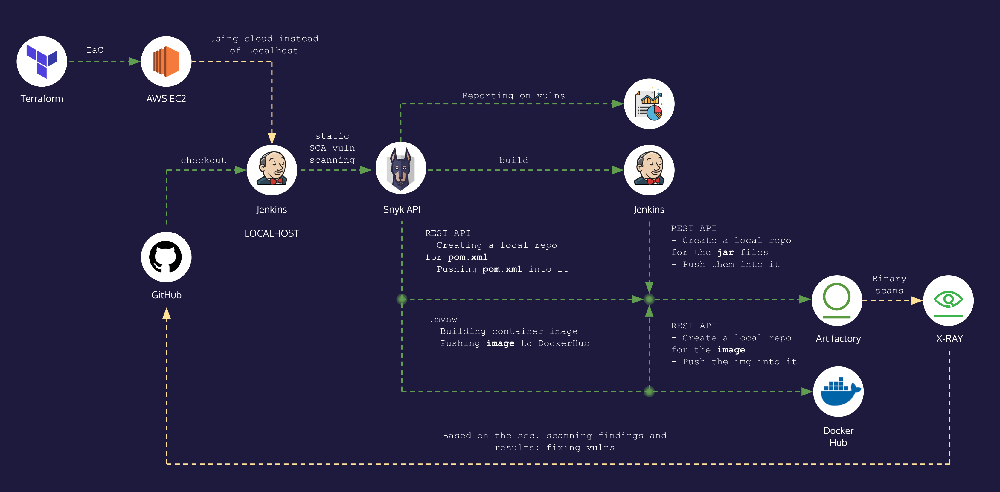

# CI/CD System for the Petclinic Springboot application

This documentation provides an overview of the CI/CD (Continuous Integration/Continuous Deployment) system I implemented for the Springboot Petclinic project. The system follows a specific workflow to build, test, and deploy the application.

## How It Works (overview)

<DIV align="centre"></DIV><br/>

The CI/CD system operates as follows:

0. I forked the Springboot Petclinic project from the original GitHub repository to my own repository. The original repository link is: [https://github.com/spring-projects/spring-petclinic](https://github.com/spring-projects/spring-petclinic).

1. We'll use Jenkins as the CI/CD tool. I created multiple Freestyle Jobs in Jenkins to add granularity and better control over the pipeline, once a job is done, it triggers the logically following jobs. Of course it could've been possible to write one regular Jenkins pipeline and separate these tasks into several stages.
Jenkins will checkout the project and perform the following steps then.

2. Run a Snyk security scan (Snyk Open Source) to identify and address any vulnerabilities and generate a reporting based on the findings.
In this step we leverage the JFrog REST API to create a local repo in Artifactory for the `pom.xml` file. Naming conventions are essential, I used the `local/remote-technology-project` schema.

3. Build the application using Maven.
In this step we also leverage the JFrog REST API to create a local repo in Artifactory for the `.jar` file(s)

4. Build a Docker image and push it to Artifactory (like before: before pushing, a separate local repository is created in Artifactory using the JFrog REST API.) and DockerHub

This workflow ensures that the project is thoroughly tested, built, and stored in Artifactory and DockerHub for deployment.

# Prerequisites

Before setting up the CI/CD system, ensure that the following prerequisites are met:

- The system can be implemented on any host. For this documentation, I implemented on `localhost`. However, an optional Terraform script is provided to spin up an EC2 instance on AWS and install Jenkins there.

- If you're a Mac user like me, I recommend using Homebrew for installing the required tools. You can download Homebrew from [https://brew.sh](https://brew.sh).

- Install the following tools using Homebrew:
  - JFrog CLI (`jfrog`)
  - Jenkins LTS (`jenkins-lts`)
  - Snyk (`snyk`)
  - Rosetta (required for Snyk)

- Install Docker Desktop by downloading it from [https://www.docker.com/products/docker-desktop](https://www.docker.com/products/docker-desktop).

- Install Java (OpenJDK). For example, you can use OpenJDK version 20.0.1, as follows (Make sure the installed Java version is compatible with the Springboot Petclinic project): 
```bash 
$ brew install openjdk@20.0.1
```
- I wrote several bash scripts for the pipelines, a good IDE of your choice is also recommended to highlight the syntax.

:rotating_light: IMPORTANT!
- You can use the following commands to start, restart and stop Jenkins:
```bash
brew services stop jenkins-lts
brew services start jenkins-lts
brew services restart jenkins-lts  
```

- By default, Docker is not going to be available from Jenkins is you installed it with Homebrew, make sure you add it the `.plist` file.
``` /opt/homebrew/Cellar/jenkins-lts/<version>/homebrew.mxcl.jenkins-lts.plist```

Then restart Jenkins:
```bash
brew services restart jenkins-lts
```

<details>
<summary>:hammer_and_wrench: You can use this code below </summary><br/>
  
```bash
<key>EnvironmentVariables</key>
    <dict>
      <key>PATH</key>
      <string>/usr/local/bin:/usr/bin:/bin:/usr/sbin:/sbin:/Applications/Docker.app/Contents/Resources/bin/:/Users/<yourUsername>/Library/Group\ Containers/group.com.docker/Applications/Docker.app/Contents/Resources/bin</string>
    </dict>
  </dict>
```
  
</details>


